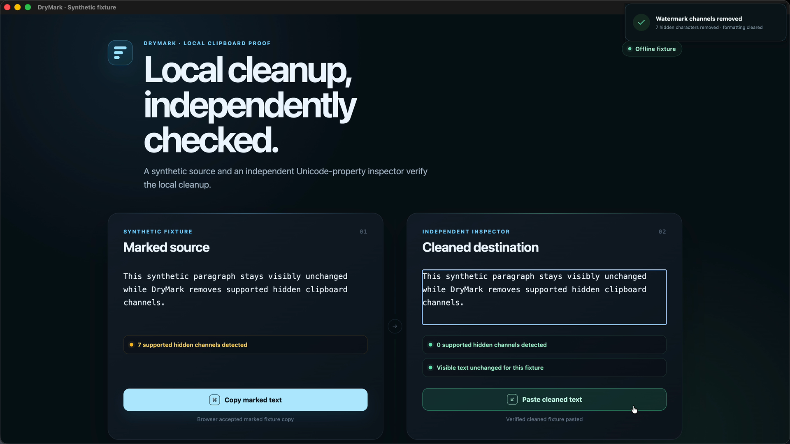
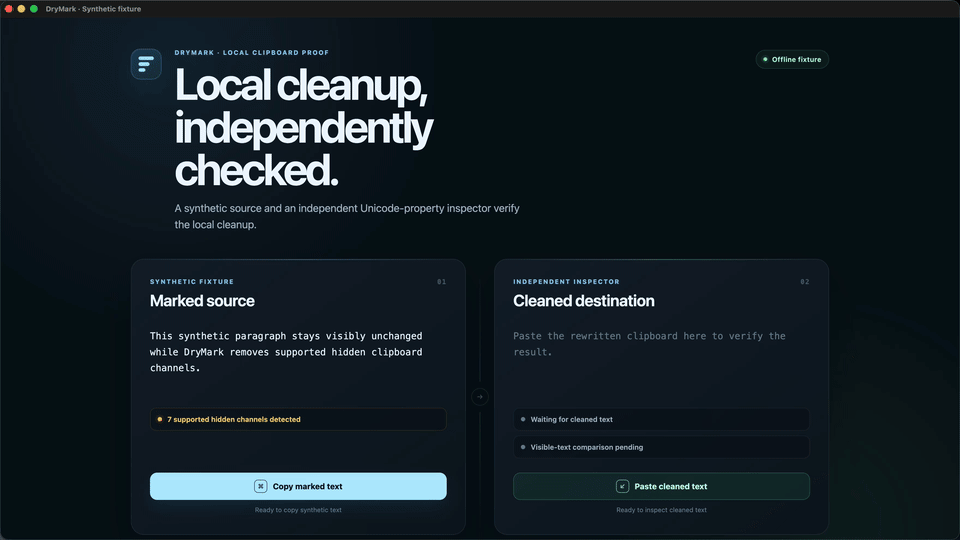
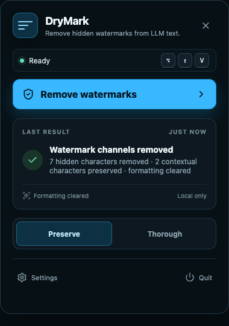
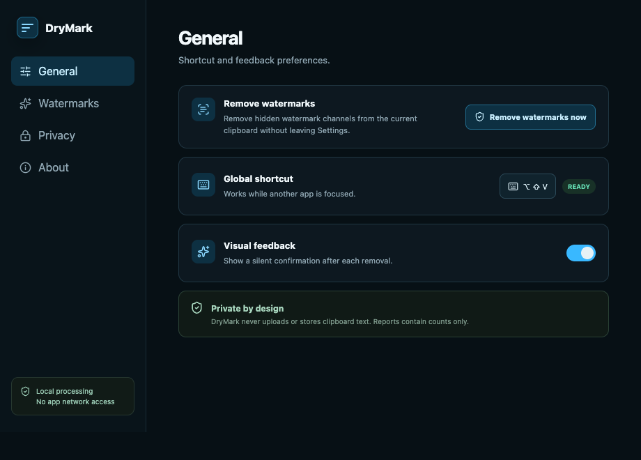

<h1 align="center">DryMark</h1>

<p align="center"><strong>LLM watermark removal for copied text.</strong></p>

<p align="center">
  <a href="https://github.com/gabrimatic/drymark/actions/workflows/ci.yml"></a>
  <a href="https://github.com/gabrimatic/drymark/actions/workflows/security.yml"></a>
  <a href="LICENSE"></a>
  <a href="docs/platforms.md"></a>
  <a href="docs/threat-model.md"></a>
</p>

DryMark removes supported hidden Unicode channels and rich clipboard formats
from AI-generated text. Copy text, press one shortcut, then paste a fresh
plain-text result. DryMark does not paraphrase the text, make network requests,
or keep a clipboard history.

<p align="center">
  
</p>

## See it work

<p align="center">
  <a href="https://gabrimatic.github.io/drymark/demo/"></a>
</p>

[Watch the 10-second silent demonstration with full-size controls.](https://gabrimatic.github.io/drymark/demo/)

This is a real macOS run of the packaged app using the system clipboard and
DryMark's global shortcut. The input is a synthetic local fixture; its
independent inspector checks the pasted result with generic Unicode properties
and does not use DryMark's engine.

CI builds native packages for macOS, Windows, and Linux. This demonstration is
runtime evidence for macOS only; the current Windows and Linux evidence covers
native builds, automated tests, and platform packaging gates. See
[Platform support](docs/platforms.md) for the exact verification boundary.

## How it works

1. Copy AI-generated text.
2. Press **Alt+Shift+V** (or set your own global shortcut).
3. Paste the rewritten clipboard as fresh plain text.

The default Preserve policy protects recognized emoji, shaping-script joiners,
variation sequences, and balanced bidirectional isolates. It removes supported
direction marks, annotation delimiters, invisible notation operators, and
other hidden channels. Thorough mode removes every format channel handled by
the engine and normalizes whitespace and Unicode composition.

DryMark has no account, telemetry, app clipboard history, or app network
access. It does not install a login item or background service; open the app
when you want the tray shortcut available.

## Scope

DryMark removes supported LLM watermark channels encoded in text or clipboard
representations it can inspect. It does not paraphrase or deliberately rewrite
visible wording. Signals carried by word choice, punctuation, sentence order,
token distribution, or semantics remain outside its lossless scope, as do
signals absent from the copied text.

Hashing, encryption, and secret keys do not change this boundary: DryMark can
remove a supported hidden carrier without decoding its payload, but a signal
encoded in visible token choices requires rewriting those tokens. See the
[watermark landscape](docs/watermark-landscape.md) for the complete capability
matrix, including statistical watermarks and signed file provenance.

Preserve prioritizes legitimate script behavior and minimal presentation
change; Thorough prioritizes canonical form and may change presentation. Even
Preserve cannot guarantee identical rendering or machine interpretation:
some invisible Unicode controls carry legitimate semantics and can also carry
hidden data. Removing them is inherently lossy; retaining them leaves that
channel intact. See the [threat model](docs/threat-model.md).

DryMark is a text sanitizer, not a compliance bypass. Removing a supported
carrier does not cancel any disclosure, copyright, provenance, contract, or
anti-fraud duty that applies to its use. See
[Legal and responsible use](docs/legal.md).

## Setup

Requirements: the pinned Rust 1.97.1 toolchain, Node.js 22 or newer, and the
[Tauri prerequisites](https://v2.tauri.app/start/prerequisites/) for your
operating system.

```bash
git clone https://github.com/gabrimatic/drymark.git
cd drymark
./setup.sh
```

On Windows PowerShell:

```powershell
git clone https://github.com/gabrimatic/drymark.git
Set-Location drymark
.\setup.ps1
```

The setup checks prerequisites, builds the native app, and installs it for the
current user. It never configures automatic startup. Use `./setup.sh --check`
or `.\setup.ps1 -Check` for a non-mutating prerequisite check, and use the
build-only option when you want a package without installation.

## What it removes

DryMark is channel-based, not vendor-specific. It removes the supported
watermark carriers below regardless of which model or service produced the
text; it does not depend on a provider signature or a list of known generators.

| Channel | Preserve | Thorough |
| --- | --- | --- |
| Zero-width separators, word joiners, BOMs, soft hyphens | Remove | Remove |
| Bidi embeddings, overrides, deprecated controls, and unbalanced isolates | Remove | Remove |
| Valid emoji joiners, emoji tags, and variation sequences | Keep and report | Remove |
| Contextual Arabic-family and Indic shaping joiners | Keep and report | Remove |
| Balanced bidi isolates used for legitimate mixed-direction text | Keep and report | Remove |
| Unicode noncharacters, default-ignorables, and unsafe controls | Remove | Remove |
| Private-use scalars | Keep and report | Remove |
| Rich HTML, RTF, and app-specific clipboard layers | Drop on clipboard rewrite | Drop on clipboard rewrite |
| Line endings, separator spaces, trailing horizontal whitespace, NFC | Preserve | Canonicalize |

The complete policy is documented in [Unicode policy](docs/unicode-policy.md).
Reports contain counts and stable categories only; they never contain clipboard
excerpts. Registered variation sequences are validated against vendored Unicode
17 and IVD data; see [third-party notices](THIRD_PARTY_NOTICES.md).

## Desktop app

The tray keeps the active shortcut, removal action, latest count-only result,
and policy in one compact surface. Settings exposes shortcut, policy, visual
feedback, and privacy controls without showing clipboard content.

<p align="center">
  
  
</p>

## Clipboard safety

DryMark uses a compare-before-write, verify-after-write transaction:

1. Read the current text into zeroizing memory.
2. Remove supported watermark channels locally with no I/O.
3. Read the clipboard again immediately before writing.
4. Abort if text changed or any adapter-provided revision or format metadata differs.
5. Replace all representations with one fresh plain-text value.
6. Read back the text immediately and report success only when it matches.

The desktop adapter cannot enumerate formats or obtain an atomic clipboard
revision, so it conservatively rewrites every text clipboard. A change detected
by the final pre-write read causes no write. Operating-system clipboards do not
offer compare-and-swap, however: a change in the narrow read/write interval can
still be overwritten. The post-write read detects a mismatch but cannot roll it
back; DryMark then reports that clipboard state is unknown. Where no revision
is available, two identical reads prove text equality only; same-text ownership
changes and format-only changes remain outside the adapter's visibility.

DryMark itself performs no network requests and keeps no clipboard history.
The system clipboard remains an OS-managed shared resource: cloud clipboard,
clipboard history, or device-continuity features may retain or sync values when
the user has enabled them.

## Command line

Install the standalone CLI from source:

```bash
cargo install --path crates/drymark-cli --locked
```

Clean a UTF-8 stream from Bash or zsh:

```bash
printf $'same\u200b words' | drymark clean
printf $'Cafe\u0301\r\n' | drymark clean --policy thorough
```

The PowerShell 7 equivalents are:

```powershell
"same$([char]0x200B) words" | drymark clean
"Cafe$([char]0x0301)" | drymark clean --policy thorough
```

Inspect without returning text from Bash or zsh:

```bash
printf $'word\u2060joiner' | drymark scan --json
```

Or from PowerShell 7:

```powershell
"word$([char]0x2060)joiner" | drymark scan --json
```

Use `drymark clean --check` in scripts. It writes nothing and exits with code
3 when watermark removal would change the input. Exit 0 means success or
unchanged input, 1 means an I/O, size, or UTF-8 failure, and 2 is reserved for
invalid command usage. The CLI reads at most 16 MiB plus one byte, invalid UTF-8
is rejected, and diagnostics never echo input. The desktop also rejects text
above 16 MiB, but only after the OS clipboard API has returned the string; that
guard is a processing limit, not a pre-allocation bound.

## Architecture

```text
crates/drymark-core          Pure deterministic Unicode policy
crates/drymark-transaction   Race-aware clipboard coordinator
crates/drymark-cli           Streaming command-line interface
apps/desktop                   React settings, tray, and silent toast
apps/desktop/src-tauri         Native Tauri shell and platform adapters
fuzz                           Removal engine and clipboard transaction fuzz targets
```

The core has no OS, clipboard, UI, or network dependency. Platform code sits
behind a small clipboard port, which keeps the policy testable and reusable.
More detail is in [Architecture](docs/architecture.md).

## Development

```bash
npm ci
npm run lint:ui
npm run test:ui
npm run build
cargo fmt --all -- --check
cargo clippy --locked --workspace --all-targets --all-features -- -D warnings
cargo test --locked --workspace --all-targets
npm audit --audit-level=high
cargo audit
cargo deny check
npm run tauri -- build -- --locked
```

The required CI graph also runs bounded native AddressSanitizer fuzzing, Rust
and npm dependency policy checks, and core mutation testing. Longer scheduled
fuzz and mutation workflows supplement those merge gates. See [Testing](docs/testing.md) for the
full verification matrix and [Platforms](docs/platforms.md) for OS-specific
behavior. Dependency advisories, accepted licenses, and the one reviewed
transitive exception are recorded in [Supply-chain policy](docs/supply-chain.md).

## Contributing

Focused issues and pull requests are welcome. Read [CONTRIBUTING.md](CONTRIBUTING.md)
and the [security policy](SECURITY.md) first.

## License

DryMark is available under the [MIT License](LICENSE).

---

Created by [Soroush Yousefpour](https://gabrimatic.info)

[](https://www.buymeacoffee.com/gabrimatic)
